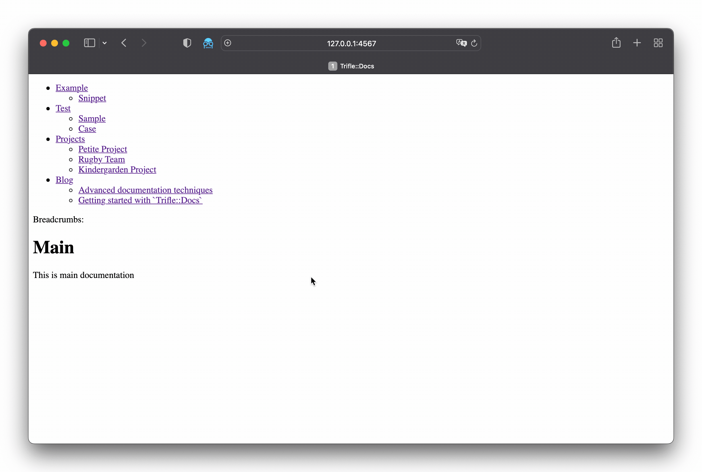

# Trifle::Docs

[](https://rubygems.org/gems/trifle-docs)
[](https://github.com/trifle-io/trifle-docs)

Simple router for static documentation. Map a folder of Markdown, textile, or other files to URLs and render them with minimal templates. Drop it into Rack, Rails, or Sinatra.

Part of the [Trifle](https://trifle.io) ecosystem.



## Quick Start

```ruby
gem 'trifle-docs'
```

### 1. Configure

```ruby
require 'trifle/docs'

Trifle::Docs.configure do |config|
  config.path = File.join(__dir__, 'docs')
  config.views = File.join(__dir__, 'templates')
  config.register_harvester(Trifle::Docs::Harvester::Markdown)
  config.register_harvester(Trifle::Docs::Harvester::File)
end
```

### 2. Create documentation structure

```
docs/
├── index.md
├── getting-started/
│   ├── index.md
│   └── installation.md
└── api/
    ├── index.md
    └── reference.md
```

### 3. Mount in your app

```ruby
# Rack middleware
use Trifle::Docs::Middleware

# Rails
Rails.application.routes.draw do
  mount Trifle::Docs::Engine => '/docs'
end
```

### 4. Templates

```erb
<!-- templates/layout.erb -->
<!DOCTYPE html>
<html lang="en">
  <head><title>Docs</title></head>
  <body><%= yield %></body>
</html>

<!-- templates/page.erb -->
<%= content %>
```

Template variables: `sitemap`, `collection`, `content`, `meta`.

## Features

- **File-based routing.** Folder structure becomes URL paths.
- **Multiple harvesters.** Markdown (with frontmatter), static files, custom processors.
- **Template system.** ERB templates with layout support.
- **Flexible integration.** Rack, Rails, Sinatra.
- **Navigation helpers.** Automatic menu and breadcrumb generation.
- **Sitemap XML.** Auto-generated with configurable base URL.

## Documentation

Full guides and API reference at **[docs.trifle.io/trifle-docs](https://docs.trifle.io/trifle-docs)**

## Trifle Ecosystem

| Component | What it does |
|-----------|-------------|
| **[Trifle App](https://trifle.io/product/app)** | Dashboards, alerts, scheduled reports, AI-powered chat. |
| **[Trifle::Stats](https://github.com/trifle-io/trifle-stats)** | Time-series metrics for Ruby (Postgres, Redis, MongoDB, MySQL, SQLite). |
| **[Trifle CLI](https://github.com/trifle-io/trifle-cli)** | Terminal access to metrics. MCP server mode for AI agents. |
| **[Trifle::Traces](https://github.com/trifle-io/trifle-traces)** | Structured execution tracing for background jobs. |
| **[Trifle::Logs](https://github.com/trifle-io/trifle-logs)** | File-based log storage with ripgrep-powered search. |

## Contributing

Bug reports and pull requests are welcome on GitHub at https://github.com/trifle-io/trifle-docs.

## License

The gem is available as open source under the terms of the [MIT License](https://opensource.org/licenses/MIT).
